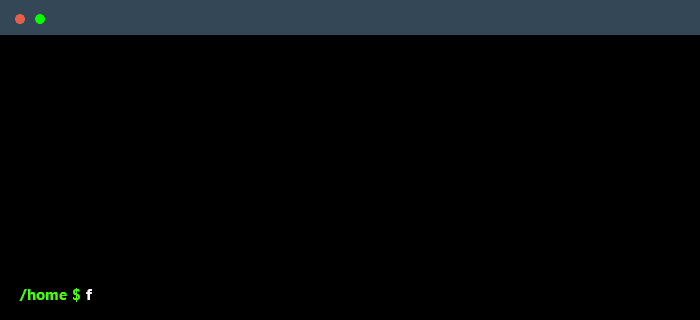

# Welcome

<!-- PROJECT LOGO -->
 

  

  <h3 align="center">FHIR ⨯ OpenAPI Toolkit</h3>

  

   A Python toolkit for FHIR (Fast Healthcare Interoperability Resources) profile construction, validation, and integration with OpenAPI specifications, allowing seamless mapping of FHIR resources to OpenAPI-conformed API responses and vice versa
     
     
  

:construction: <i>This is an experimental package. Major changes are to be expected.</i>

## Features

 :star: **Dynamic FHIR profile models:** Build and manage FHIR profiles using Pydantic objects, enabling validation of profiled FHIR resources.

 :star: **OpenAPI x FHIR Validation:** Parse OpenAPI specifications with FHIR-related extensions to validate their integration with FHIR.

 :star: **Pythonic FHIRPath:** A fully pythonic normative-compliant FHIRPath lexer and parser 

 :star: **FHIR<->OpenAPI Mapping:** Map FHIR resources to OpenAPI-conformed JSON responses and vice versa.

    

