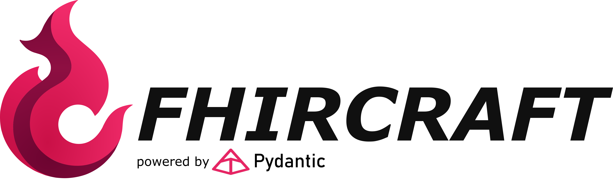

---
hide:
  - navigation
  - toc
---

# Welcome to

<!-- PROJECT LOGO -->

Fhircraft transforms FHIR (Fast Healthcare Interoperability Resources) specifications into type-safe Python models using Pydantic. Build healthcare applications with automatic validation, intelligent code completion, and seamless integration with Python's ecosystem.

[Get Started :fontawesome-solid-rocket:](quickstart/installation.md){ .md-button .md-button--primary }
[Learn the Basics :fontawesome-solid-book-open:](quickstart/basics.md){ .md-button }

!!! warning "Active development"
  
    Fhircraft is under active development. Expect breaking changes in future releases.

## Why Choose Fhircraft?

**Type Safety & Validation**

Generate validated Pydantic models from FHIR specifications. Catch data errors at development time, not in production.

**Pythonic FHIR Development**

Work with FHIR resources using familiar Python patterns. No need to learn complex FHIR server infrastructure.

**Multi-Release Support**

Seamlessly work with FHIR R4, R4B, and R5. Switch between versions as your project requires.

**FHIRPath Integration**

Query and validate FHIR data using the standard FHIRPath language, fully integrated with Python.

**Flexible Architecture**

Use local files for security, remote URLs for convenience, or hybrid approaches for production systems.  

**Mapping Integration**

Leverage the the FHIR Mapping Language to define conversions between FHIR resources, fully integrated with Python.
